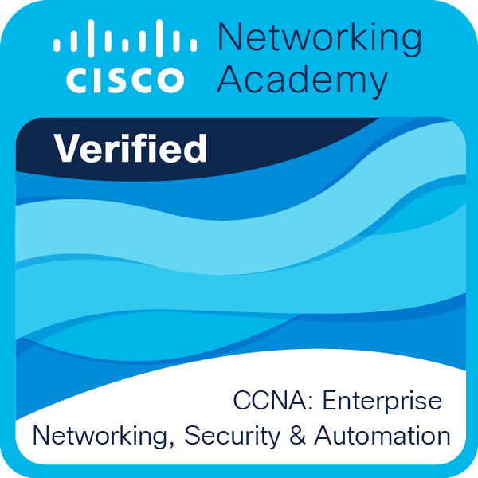

### Hi there, I'm Orzyj! 👋

I'm a **Master's Student in Computer Science** and a Software Developer.
My main focus is on **C++**, **Python**, and **Embedded Systems**. I also have academic background in **SQL**.

Currently, I'm working on an **ECG analysis device** for my Master's thesis.

---

### Badges

  
  &nbsp;&nbsp;&nbsp;&nbsp;
  
  &nbsp;&nbsp;&nbsp;&nbsp;
  

---

### 🛠️ Languages and Tools

  
  
  
  
  
  
  
  

---

### 📊 My GitHub Stats

  

### Statistics / Programming Languages

---

  

---

  

---

### 🎓 Academic & Engineering Projects

* **Tracked Robot (Engineering Thesis)** - A mobile robot project built with **C++** and **Python**, focusing on embedded control systems.
* **ECG Analysis Device (Master's Project)** - *[In Progress]* Developing a device and software for analyzing electrocardiogram signals.

### 🚀 Personal Projects

* **[Rubik-s-Challenge](https://github.com/Orzyj/Rubik-s-Challenge)** - A 3D Rubik's Cube simulation built with C++, OpenGL, and Qt.

  

* **[Sudoku](https://github.com/Orzyj/Sudoku)** - A classic Sudoku game.

  

  
* **[HexEditor](https://github.com/Orzyj/HexEditor)** - A classic hex editor.

  

